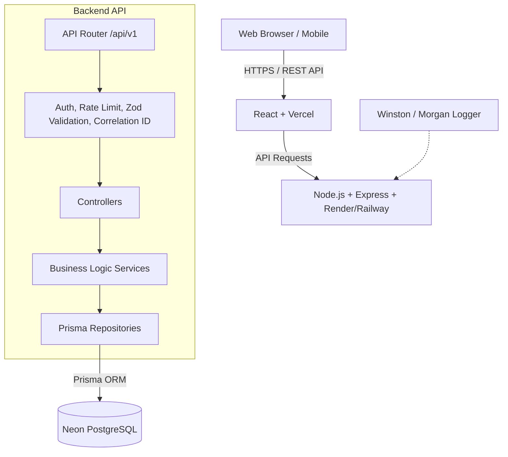
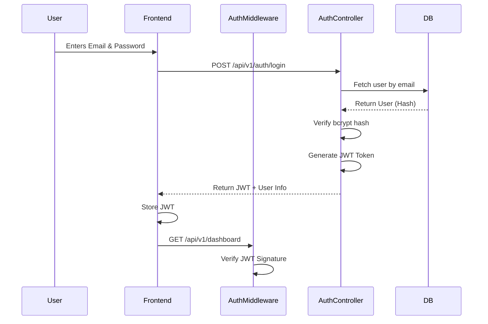
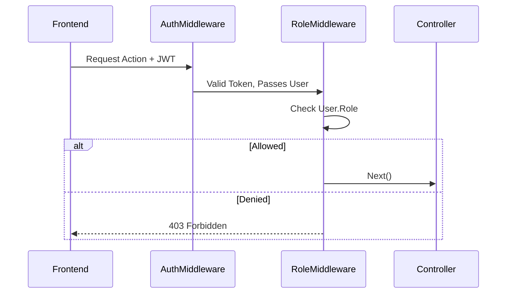
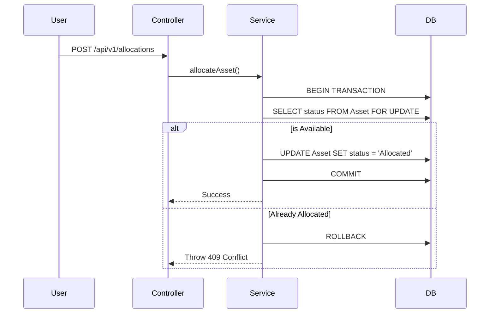
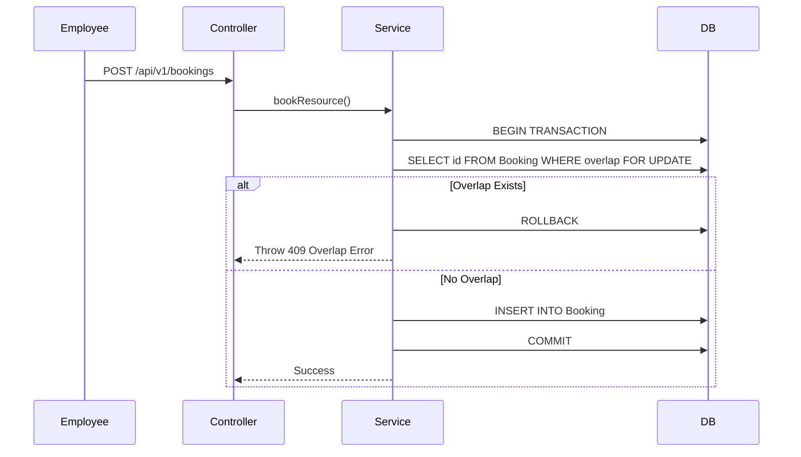

# Phase 1: System Architecture Design - AssetFlow

## 1. High-Level System Architecture Diagram



## 2. Folder Structure

We will use a monorepo structure to keep frontend and backend in one repository.

```text
AssetFlow/
├── frontend/                  
│   ├── public/                
│   ├── src/
│   │   ├── components/        
│   │   ├── features/          
│   │   ├── services/          
│   │   └── App.tsx            
│   └── package.json
│
├── backend/                   
│   ├── prisma/                
│   ├── src/
│   │   ├── config/            
│   │   ├── controllers/       
│   │   ├── middlewares/       
│   │   ├── routes/            
│   │   ├── services/          
│   │   ├── utils/             
│   │   └── server.ts          
│   └── package.json
└── README.md
```

## 3. Frontend Architecture

*   **Framework:** React with TypeScript.
*   **State Management:** React Query for server-state caching.
*   **Routing:** React Router v6 with Role-Based Protected Routes.
*   **Styling:** Tailwind CSS.
*   **Forms:** React Hook Form + Zod validation.

## 4. Backend Architecture

*   **Architecture Pattern:** Clean Architecture (Routes -> Controllers -> Services -> Repositories).
*   **Validation:** Zod schemas at the middleware level.

## 5. API Versioning

All API routes will be strictly versioned under the `/api/v1/` prefix to ensure backward compatibility for future mobile applications or external integrations.
*   Example: `/api/v1/auth/login`
*   Example: `/api/v1/assets/:id`
*   Example: `/api/v1/bookings`

## 6. Authentication & Storage Strategy

### Flow Diagram


### Storage Decision
*   **Production Standard:** JWT must be stored in an `HttpOnly`, `Secure`, `SameSite=Strict` cookie to prevent XSS attacks.
*   **Hackathon MVP Trade-off:** If cross-domain deployment issues arise during the hackathon (e.g., Vercel frontend domain vs. Railway backend domain), `LocalStorage` may be used as a fallback. 
    *   *Risk Note:* Using `LocalStorage` exposes the JWT to Cross-Site Scripting (XSS). To mitigate this, strict Content Security Policies (CSP) and React's built-in XSS protections will be heavily relied upon.

## 7. Authorization Flow Diagram (RBAC)



## 8. Standard API Response Contract

Every endpoint must conform to the following unified response structure to ensure predictability for the frontend client.

**Success Response:**
```json
{
  "success": true,
  "message": "Asset allocated successfully",
  "data": {
    "allocationId": "uuid-1234",
    "assetId": "uuid-5678"
  }
}
```

**Error Response:**
```json
{
  "success": false,
  "error": {
    "code": "CONFLICT",
    "message": "Asset already allocated",
    "details": null
  }
}
```

## 9. Environment Configuration

The system relies on a `.env` file managed securely via deployment platforms (Vercel/Render).

| Variable | Description | Mandatory |
| :--- | :--- | :--- |
| `DATABASE_URL` | Neon Postgres connection string | Yes |
| `JWT_SECRET` | Cryptographic secret for signing tokens | Yes |
| `JWT_EXPIRES_IN` | Token lifespan (e.g., `1d`, `8h`) | Yes |
| `BCRYPT_SALT_ROUNDS` | Cost factor for hashing (default: 10) | Yes |
| `PORT` | Backend server port (default: 5000) | No |
| `NODE_ENV` | `development`, `production`, or `test` | Yes |
| `CLIENT_URL` | Allowed origin for CORS (e.g., Vercel URL) | Yes |
| `LOG_LEVEL` | Logging verbosity (e.g., `info`, `debug`) | No |

## 10. Logging & Request Correlation

*   **Correlation ID:** A unique `x-request-id` (UUID) will be generated at the edge middleware for every incoming HTTP request.
*   **Logging Output:** Winston will format logs to include:
    *   `Timestamp` (ISO 8601)
    *   `Request ID` (Correlation ID)
    *   `User ID` (If authenticated)
    *   `IP Address`
    *   `Execution Time` (ms)
*   **Audit Logging:** Critical business actions (allocations, approvals, role changes) will be written directly to a database `AuditLog` table.

## 11. Health Check Endpoint

A dedicated, unauthenticated endpoint to monitor system uptime.
*   **GET /api/v1/health**
*   **Response:**
    ```json
    {
      "success": true,
      "message": "System is healthy",
      "data": {
        "status": "OK",
        "database": "Connected",
        "version": "1.0.0",
        "environment": "production",
        "uptime": "24h 15m 10s"
      }
    }
    ```

## 12. File Storage Strategy

*   **Hackathon MVP Choice:** **Local Uploads via Multer**.
*   **Reasoning:** To minimize external dependencies, API keys, and setup time during a time-constrained 24-hour hackathon, asset photos will be stored on the backend disk in a `/public/uploads` directory.
*   **Production Note:** For a true production ERP, a cloud blob storage like AWS S3 or Cloudinary should be used to support horizontal scaling of the backend servers.

## 13. Sequence Diagrams

### Asset Allocation


### Resource Booking


## 14. Architecture Decision Record (ADR)

*   **Node.js/Express:** High developer velocity, non-blocking I/O.
*   **Prisma ORM:** Strong type-safety, parameterized queries prevent SQL injection.
*   **Neon PostgreSQL:** ACID compliant, handles concurrency (row-level locking).
*   **React Query:** Replaces Redux for server-state management.
*   **Zod:** Unified validation schema for both frontend and backend.
*   **Soft Deletes:** Preserves historical audit data integrity (mandatory for ERPs).

## 15. Module Development Order

The implementation will strictly follow this sequence to ensure dependencies are resolved:
1.  **Project Setup** (Monorepo, Linting, Boilerplate)
2.  **Database** (Prisma Schema, Migrations, Seeding)
3.  **Authentication** (Login, JWT, BCrypt)
4.  **RBAC** (Role Middleware)
5.  **Organization Setup** (Departments, Categories, Directory)
6.  **Asset Module** (Registration, Listing)
7.  **Allocation Module** (Checkout, Transfers, Returns)
8.  **Booking Module** (Calendar slots, Overlap prevention)
9.  **Maintenance Module** (Workflow approvals)
10. **Audit Module** (Cycles, Discrepancy flagging)
11. **Reports** (Analytics, Heatmaps)
12. **Notifications** (Activity Logs)
13. **Testing** (Unit/Integration testing)
14. **Deployment** (Vercel, Render)

## 16. Security Appendix

*   **Helmet:** Applied globally to set secure HTTP headers (e.g., X-XSS-Protection, Strict-Transport-Security).
*   **Rate Limiting:** `express-rate-limit` applied globally to prevent brute force and DDoS attacks.
*   **CORS:** Strictly configured to only allow requests from the `CLIENT_URL`.
*   **Input Validation:** `Zod` guarantees payload structure before controller logic executes.
*   **Password Hashing:** `bcrypt` with salt rounds defined in ENV.
*   **JWT Expiration:** Short-lived tokens to reduce window of compromise.
*   **RBAC:** Server-side enforcement. UI hiding is not considered a security layer.
*   **Audit Logging:** Critical actions are tracked immutably.
*   **OWASP Top 10:** Addressed via ORM (SQLi), Helmet/React (XSS), CORS/JWT (CSRF), and RBAC (Broken Access Control).
*   **Secret Management:** No secrets committed to git; strictly managed via deployment platform ENV variables.

## 17. Architecture Review Summary

*   **Architecture Strengths:**
    *   Highly modular and scalable Clean Architecture.
    *   Strict transactional concurrency control for critical ERP functions (allocation/booking).
    *   Robust security posture covering OWASP Top 10.
*   **Known Trade-offs:**
    *   Local file storage instead of S3 (to optimize hackathon time).
    *   Potential use of LocalStorage for JWTs if cross-domain cookie issues arise during rushed deployment.
*   **Future Improvements:**
    *   Migrate file storage to AWS S3.
    *   Implement Redis for distributed caching.
    *   Move JWT to strictly HttpOnly cookies with a refresh token mechanism.
*   **Production Readiness Assessment:**
    *   The architecture is structurally sound for an enterprise MVP. With the mitigation of the known trade-offs, it can confidently scale into a production environment.
